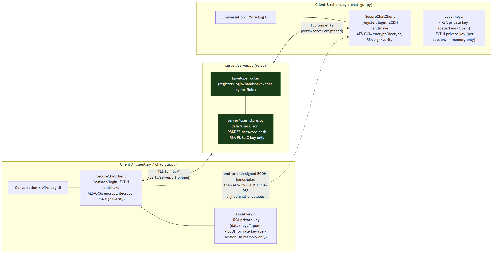

# Secure Chat Application with Encryption

**CNS course project — Team 15.**

A client-server chat application in which two peers exchange messages that the relay
server and any network observer can never read in plaintext: each session starts with
an RSA-signed ECDH (X25519) handshake between the two peers (never trusting the server
to broker keys), derives a fresh AES-256-GCM session key, signs and encrypts every
message with it, wraps the whole client↔server connection in TLS, gates every
connection behind a PBKDF2-hashed login, and rejects replayed or tampered messages —
all seven properties backed by 74 automated tests and three live attack-and-defense
demo scripts, plus a Tkinter GUI whose "Wire Log" panel makes the cryptography visible
during a demo instead of invisible.

PDF copies of this documentation are available in [`docs/pdf/`](docs/pdf/) for offline
viewing or printing.

## Quick start (clean clone → working two-GUI demo)

```
git clone <this repo's URL>
cd CNSProject
pip install -r requirements.txt
python certs/generate_certs.py     # one-time: generates certs/server.crt + server.key
python server/server.py            # terminal 1 — leave this running
python gui/chat_gui.py             # terminal 2
python gui/chat_gui.py             # terminal 3
```

In each GUI window: fill in a username, the *other* window's username as the peer, and
a password, then click **Register** (the first time) or **Login** (afterward). Once
both windows show a fingerprint at the top, type a message and click **Send** — it
appears in the **Conversation** panel on both sides, and its encrypted form appears in
the **Wire Log** panel. For the exact, click-by-click version of this (what a teammate
who's never run it before should do, live in front of the professor), see
[`demo/full_walkthrough.md`](demo/full_walkthrough.md).

## Architecture

Two clients, one relay server, TLS wrapping every connection, and an inner
end-to-end layer (ECDH + AES-GCM + RSA) the server itself cannot see into:



See [`docs/architecture.md`](docs/architecture.md) for the full-resolution diagram,
the Mermaid source, and a breakdown of exactly what the server can and cannot see at
each point.

## Security properties

Every row names the module that implements the property and a real, currently-passing
test that exercises it (verified — see "Running the tests" below):

| Property | What guarantees it | Module | Real test |
|---|---|---|---|
| **Confidentiality** | AES-256-GCM encrypts every chat message with a per-session key the server never holds; TLS additionally wraps the whole connection | `crypto_engine/aes_gcm.py`, `certs/` + `connect_tls()` in `client/client.py` | `tests/test_aes_gcm.py::test_ciphertext_is_not_plaintext` |
| **Integrity** | AES-GCM's authentication tag detects any bit-flip in transit; a compromised relay that tampers a message cannot get it accepted | `crypto_engine/aes_gcm.py` | `tests/test_aes_gcm.py::test_tampered_ciphertext_is_rejected` |
| **Authentication** | The ECDH handshake itself is signed with each side's RSA identity key and verified before any session key is derived, stopping a relay from substituting its own key mid-handshake | `crypto_engine/signatures.py`, signed-handshake logic in `client/client.py` | `tests/test_handshake_auth.py::test_handshake_signed_with_wrong_key_is_rejected` |
| **Non-repudiation** | Every chat message is signed with the sender's long-term RSA private key; a message can't be forged as if signed by someone else's key | `crypto_engine/signatures.py` | `tests/test_signatures.py::test_wrong_public_key_fails_verification` |
| **Key management** | A brand-new ECDH keypair is generated for every session (forward secrecy — compromising one session's key reveals nothing about any other); each identity's long-term RSA private key never leaves its own machine | `crypto_engine/dh_exchange.py`, `auth/keystore.py` | `tests/test_dh_exchange.py::test_fresh_keypairs_produce_different_session_keys` |
| **Access control** | A connection is not admitted to the roster or allowed to route any handshake/chat envelope until it completes a successful PBKDF2-checked login | `auth/password_hash.py`, `server/server.py` (`_authenticate`) | `tests/test_tls_setup.py::test_tls_client_wrong_password_login_rejected` |

Run any single one directly, e.g. `pytest tests/test_aes_gcm.py::test_ciphertext_is_not_plaintext -v`.

## Known limitations

Said out loud, not buried — these are the honest edges of this project's scope:

- **The register/login password is not protected beyond TLS.** The AES-GCM/RSA layer
  only exists between two chat *peers*, after a handshake; it doesn't cover the
  client↔server login exchange, which relies entirely on TLS. If the server itself
  were compromised, it would see plaintext passwords (never plaintext chat content,
  and never anyone's private key) at the moment of login, before hashing. See
  [`docs/architecture.md`](docs/architecture.md#what-the-server-can-see).
- **RSA private keys are stored unencrypted on disk** (`data/keys/<username>_private.pem`).
  A production system would wrap this file under a key derived from the user's
  password; this project deliberately scoped that out — see the comment in
  `auth/keystore.py`.
- **No account recovery.** If a user's private key file is lost, their account cannot
  send verifiable messages again without re-registering under a new username — there
  is no re-keying or password-reset flow.
- **Self-signed cert trust is manual and local.** Each teammate must run
  `certs/generate_certs.py` and the *same* generated `certs/server.crt` must be present
  on every machine the server and clients run on; there's no certificate authority or
  distribution mechanism beyond "share the file."
- **The server trusts a client's claimed `from` field for routing.** It does not
  cryptographically bind a connection's authenticated username to the `from` field on
  every envelope that connection sends — the handshake/message signatures are what
  actually prevent forgery (the receiver always verifies against the *real* sender's
  RSA key, not whatever the envelope claims), but this is worth knowing rather than
  assuming the server enforces it.
- **Single relay server, no redundancy, no persistence beyond a local JSON file** —
  this is a course project demonstrating the cryptography, not a deployable service
  (no horizontal scaling, no database, no rate limiting, no replay-window
  synchronization across multiple server instances).
- **Wireshark capture is a single short session** (`demo/capture_normal_session.pcapng`),
  not a comprehensive traffic sample — see `demo/capture_instructions.md` if you want
  to record a longer one.

## Live demo scripts

`demo/run_*.py` are standalone scripts that each start their own real mini relay
server and two real clients to demonstrate one attack being stopped — meant to be run
live for a demo or in front of the professor, not just as passing tests. Each prints a
clear `[PASS]`/`[FAIL]` per check and an overall result:

| Script | What it proves |
|---|---|
| `demo/run_tamper_demo.py` | A malicious/compromised relay flipping a ciphertext byte in transit cannot get a tampered message displayed — AES-GCM's tag catches it. |
| `demo/run_replay_demo.py` | A relay resending a captured chat message a second time cannot get it displayed twice — the timestamp + duplicate-nonce tracking rejects the replay. |
| `demo/run_mitm_handshake_demo.py` | A malicious relay substituting its own ECDH public key during the handshake is stopped by the signed handshake — no session key is ever derived, and the fingerprint that would result doesn't match either. |

```
python certs/generate_certs.py   # once, if you haven't already
python demo/run_tamper_demo.py
python demo/run_replay_demo.py
python demo/run_mitm_handshake_demo.py
```

See [`demo/README.md`](demo/README.md) for more detail, and
[`demo/full_walkthrough.md`](demo/full_walkthrough.md) for the full click-by-click
live demo script (GUI + these three scripts + the Wireshark capture, with talking
points and timing).

## Running the tests

```
pip install -r requirements.txt
pytest tests/ -v
```

74 tests across 7 files, one per project phase: `test_aes_gcm.py` (encryption),
`test_dh_exchange.py` (key exchange), `test_password_hash.py` (login),
`test_signatures.py` (non-repudiation), `test_handshake_auth.py` (signed-handshake
MITM fix), `test_replay_protection.py` (replay defenses), `test_tls_setup.py`
(transport security).

## How to run (detail)

Requires Python 3.8+.

**0. One-time per teammate: generate a local TLS certificate.** The server and client
both need `certs/server.crt` / `certs/server.key`, which are gitignored (a committed
private key would let anyone with repo access impersonate the server) and must be
generated locally, once, by each person running this project:

```
python certs/generate_certs.py
```

This writes a self-signed cert for `CN=localhost`, valid 365 days. Re-run with
`--force` to regenerate (then restart the server and re-run this on every client, too
— an old cert and a new one won't match).

**1. Start the server** (one terminal):

```
python server/server.py
```

Defaults to `127.0.0.1:5000`; override with `--host` / `--port`. It prints
`Server listening on 127.0.0.1:5000 over TLS ...` once ready.

**2a. Terminal client** — start two clients, each naming the other as its peer (one in
each of two more terminals):

```
python client/client.py --peer bob
python client/client.py --peer alice
```

Each client first asks you to **register** a new account or **login** to an existing
one — pick `1) Register` the first time for each username, `2) Login` afterward. The
password prompt hides your input (it won't echo to the terminal).

**2b. GUI client** — see "Quick start" above, or `demo/full_walkthrough.md` for the
click-by-click version.

Registering also generates a long-term RSA-2048 identity keypair for that account (see
"Design details" below) — the private key is saved locally, and only the public key is
sent to the server. Once both peers are authenticated and online, they automatically
perform the signed ECDH handshake, fetch each other's RSA public key, and from then on
every message is signed, AES-256-GCM encrypted before it leaves the client, and
decrypted + signature-verified on arrival.

Registered accounts (PBKDF2 password hashes and RSA public keys only) persist in
`data/users.json`; each account's RSA private key is saved separately as
`data/keys/<username>_private.pem`. Both `data/users.json` and `data/keys/` are
gitignored since they hold real credentials and private key material from local
testing.

## Wire protocol

One JSON object per line (newline-terminated), carried inside the TLS tunnel. Every
envelope has a `"type"` field:

| type | direction | carries |
|---|---|---|
| `register` | client → server | `username`, `password`, `public_key` (RSA PEM text) |
| `register_result` | server → client | `success`, `reason` |
| `login` | client → server | `username`, `password` |
| `login_result` | server → client | `success`, `reason` |
| `roster` | server → client | list of currently-online usernames |
| `system` | server → client | human-readable join/leave/error text |
| `user_joined` | server → client | `username` of a newly-connected peer |
| `handshake_init` | client ↔ client (via server) | `from`, `to`, `pubkey` (base64, 32 raw bytes), `handshake_sig` (base64, RSA-PSS signature over `pubkey`) |
| `handshake_response` | client ↔ client (via server) | `from`, `to`, `pubkey` (base64, 32 raw bytes), `handshake_sig` (base64, RSA-PSS signature over `pubkey`) |
| `get_pubkey` | client → server | `username` (whose RSA public key to look up) |
| `pubkey_result` | server → client | `username`, `public_key` (RSA PEM text or null), `success` |
| `chat` | client ↔ client (via server) | `from`, `to`, `nonce`, `ciphertext`, `tag` (all base64); the plaintext AES-GCM decrypts to is itself `{"message", "timestamp", "signature"}` JSON, where `signature` covers `{message, timestamp}` together |

A connection must complete a successful `register` or `login` exchange before the
server admits it to the roster or accepts any handshake/chat envelope from it. The
server routes `handshake_init` / `handshake_response` / `chat` envelopes to the named
`to` recipient only, based on the sender's own claimed `from` field; it never inspects
or needs to understand their payload beyond that routing. `get_pubkey` is answered
directly by the server from its user store (the requested user doesn't need to be
online — a public key is public information regardless of presence).

## Design details

<details>
<summary>How the handshake works (ECDH + forward secrecy)</summary>

Each client generates a brand-new X25519 (elliptic-curve Diffie-Hellman) keypair for
every chat session — never reused across logins, so compromising one session's key
reveals nothing about any other session (forward secrecy). When two named peers are
both online, the client whose username sorts alphabetically first automatically sends
its public key to the other, relayed through the server inside a `handshake_init`
JSON envelope; the second client generates its own keypair and replies with a
`handshake_response` carrying its own public key. Both sides then independently run
`compute_shared_key()` — each combining *their own* private key with the *other's*
public key — which by the math of Diffie-Hellman produces the identical raw shared
secret on both ends without either private key ever crossing the network. That raw
secret is then passed through HKDF-SHA256 to derive a clean, uniformly random 32-byte
AES-256 key (the raw ECDH output itself is never used directly as a cipher key). From
that point on, every chat message is encrypted with `aes_gcm.encrypt()` before being
sent and decrypted with `aes_gcm.decrypt()` after being received; the relay server only
ever forwards opaque public-key bytes and encrypted (nonce/ciphertext/tag) envelopes —
it never computes, stores, or sees the shared secret, and a tampered or forged message
is rejected with a warning instead of being decrypted into garbage.

</details>

<details>
<summary>How the signed handshake stops a relay-server MITM</summary>

The handshake above has a gap: `handshake_init`/`handshake_response` carry a raw ECDH
public key, and nothing about the handshake itself ties that key to a particular long-
term identity. A malicious or **compromised relay server** — a different threat than a
network eavesdropper; TLS does not help here, since the server is the trusted TLS
endpoint — could substitute its own ECDH public key for either peer's, completing two
separate handshakes (attacker↔A, attacker↔B) while both clients believe they're
talking directly to each other. Since each client already has a long-term RSA identity,
the fix reuses it: the ECDH public key is signed with the sender's RSA private key
before sending (`handshake_sig`), and the receiver verifies that signature against the
sender's already-known RSA public key **before** computing the shared secret. If
verification fails — or the ECDH key was swapped after signing, or the signature was
produced by the wrong RSA key — the handshake **aborts with a clear error and no
session key is ever derived**; nothing gets silently trusted. After a *successful*
handshake, both clients also print a short human-readable **fingerprint** of the
peer's RSA public key (`crypto_engine/signatures.fingerprint`, the first 16 hex
characters of SHA-256 of the key's PEM bytes) — the "check key fingerprints"
mitigation: two people can read this aloud to each other (voice call, in person) to
independently confirm they hold the same identity for their peer, catching a MITM even
if some future bug let a forged handshake slip past the automated check. See
`demo/run_mitm_handshake_demo.py` for a live demonstration.

</details>

<details>
<summary>How replay protection works</summary>

A captured, validly-encrypted, validly-signed chat envelope could otherwise be resent
later (or twice) and would still pass both AES-GCM and the RSA signature check, since
neither says anything about *when* the message is being presented. Two independent
defenses close this: first, a Unix timestamp is included in what gets **signed**
(`chat_signable_bytes(message, timestamp)`) before encryption, so it travels tamper-
evident — an attacker can't just bump the timestamp on a captured message to make it
look fresh again, since that invalidates the signature. On receipt, a message is
rejected if its timestamp is more than `REPLAY_WINDOW_SECONDS` (30s) old or more than
`CLOCK_SKEW_SECONDS` (5s) in the future. Second, belt-and-suspenders: each client
tracks recently-seen `(sender, nonce)` pairs in memory (nonces are already fresh random
values per `aes_gcm.encrypt()` call, so a genuine resend from the sender would carry a
*different* nonce) and rejects an exact repeat outright, even if it somehow fell inside
the freshness window; old entries are pruned automatically once they're old enough that
the timestamp check alone would catch them anyway. See `demo/run_replay_demo.py`.

</details>

<details>
<summary>How signing works (non-repudiation)</summary>

The ECDH session key proves a message was encrypted for this pair of peers, but it's
symmetric — both sides hold it, so it can never by itself prove *which* of them
actually wrote a given message to a third party. A separate, long-term RSA-2048
keypair per user identity closes that gap: at registration a client generates its own
RSA keypair, keeps the private key on disk locally (see `auth/keystore.py`), and sends
only the public key to the server, which stores it next to that user's password hash.
Before sending a chat message, the sender signs the plaintext with its own RSA private
key (RSA-PSS + SHA-256), then wraps `{message, signature}` together as the payload
that gets AES-256-GCM encrypted — **sign, then encrypt** — so the signature travels
protected inside the same ciphertext as the message, never sent in the clear. On the
receiving side the order reverses: **decrypt, then verify** — the client AES-GCM-
decrypts the envelope, unwraps `{message, signature}`, and only then checks the
signature against the sender's RSA public key (fetched once via a `get_pubkey` request
to the server and cached for the session). A message whose signature doesn't check out
— tampered content, a forged signature, or a signature checked against the wrong
public key — is never displayed; the client prints a clear warning and discards it.

</details>

<details>
<summary>How TLS layers with the app-level crypto</summary>

TLS (`ssl.PROTOCOL_TLS_SERVER` / `PROTOCOL_TLS_CLIENT`) wraps the whole client↔server
TCP connection, wrapping every socket **before** any envelope — including the very
first register/login — is read or written. This is a **transport-layer** protection:
it makes the connection itself opaque to anyone on the network path, so an observer
between a client and the server can no longer see the JSON structure, field names, or
content of anything at all, not even metadata like `"type": "login"`. It sits
alongside, not in place of, the **application-layer** crypto — AES-GCM session keys
and RSA signatures — which protect message content and identity end-to-end between
the two chat *peers themselves*, independent of transport. The distinction that
matters: TLS protects data only while it's in transit to/from the server; the server
itself sees the connection in the clear once TLS terminates there (it's the trusted
relay, not an untrusted network link — see "Known limitations" above for what that
means for the login password specifically). AES-GCM + RSA signatures, by contrast,
protect a chat message even from the server — the server only ever sees opaque
ciphertext and routing metadata, never plaintext content, a private key, or a session
key, whether or not TLS is present. The client does not use `check_hostname=False` or
`CERT_NONE` to sidestep certificate verification — that would accept a certificate
from literally anyone, which defeats the point of using TLS at all. Instead it pins
trust to exactly the one self-signed certificate this project generated
(`certs/server.crt`, loaded via `load_verify_locations`), so a different server
presenting a different certificate is rejected at the TLS handshake, before any
envelope is ever sent.

</details>

<details>
<summary>Crypto modules — quick reference</summary>

`crypto_engine/aes_gcm.py` — standalone AES-256-GCM module:

```python
from crypto_engine import generate_key, encrypt, decrypt

key = generate_key()                       # 32 random bytes (testing only)
box = encrypt(key, b"hello")               # {"nonce", "ciphertext", "tag"}
decrypt(key, box["nonce"], box["ciphertext"], box["tag"])  # b"hello"
```

Tampered ciphertext or a wrong key raises `DecryptionError` rather than returning
garbage plaintext.

`crypto_engine/dh_exchange.py` — ECDH (X25519) key exchange + HKDF-SHA256 key
derivation:

```python
from crypto_engine.dh_exchange import generate_keypair, compute_shared_key

priv_a, pub_a = generate_keypair()
priv_b, pub_b = generate_keypair()
assert compute_shared_key(priv_a, pub_b) == compute_shared_key(priv_b, pub_a)
```

`auth/password_hash.py` — PBKDF2-HMAC-SHA256 password hashing, 200,000+ iterations, a
fresh random salt per password, and a constant-time comparison
(`hmac.compare_digest`) on verify:

```python
from auth.password_hash import hash_password, verify_password

stored = hash_password("correct horse battery staple")
# stored == "pbkdf2_sha256$200000$<salt_b64>$<hash_b64>"
assert verify_password("correct horse battery staple", stored)
assert not verify_password("wrong guess", stored)
```

`server/user_store.py` persists only that encoded hash string per username, in
`data/users.json` — the plaintext password is never written to disk.

`crypto_engine/signatures.py` — RSA-2048 signatures, RSA-PSS padding + SHA-256, with
PEM (de)serialization helpers and the `fingerprint()` helper:

```python
from crypto_engine.signatures import generate_keypair, sign, verify, fingerprint, serialize_public_key

private_key, public_key = generate_keypair()
signature = sign(private_key, b"hello")
assert verify(public_key, b"hello", signature) is True
assert verify(public_key, b"tampered", signature) is False  # never raises
print(fingerprint(serialize_public_key(public_key)))  # e.g. "A1B2 C3D4 E5F6 A7B8"
```

`auth/keystore.py` saves each account's RSA private key locally as an unencrypted PEM
file under `data/keys/<username>_private.pem` (gitignored) — see "Known limitations".

`certs/generate_certs.py` generates the self-signed TLS cert + key used by
`server.py`/`client.py`, using the `cryptography` library directly (not the `openssl`
CLI), so it produces an identical result on every teammate's machine:

```
python certs/generate_certs.py           # writes certs/server.key + certs/server.crt
python certs/generate_certs.py --force   # regenerate, overwriting existing certs
```

</details>

<details>
<summary>GUI chat client — how it's built</summary>

`gui/chat_gui.py` is a Tkinter GUI over the exact same client logic the terminal
client uses — `client/client.py`'s `SecureChatClient`, `connect_tls`, and the
signature/keystore helpers are imported and reused directly; the GUI contains no
protocol, crypto, or networking logic of its own. Besides a normal-looking chat
window (dark theme, WhatsApp-style message bubbles), it has a second **"Wire Log"**
panel that shows a live, timestamped feed of exactly what's crossing the network —
handshake public keys and signatures, each message's nonce/ciphertext/tag (truncated
for readability), and any rejected/tampered message in red. Passwords are redacted in
the wire log with a note that TLS (not the GUI) is what actually protects them in
transit; chat plaintext never appears there at all, only its ciphertext.

**On the refactor this required:** `SecureChatClient`'s logic methods (register/login,
handshake, send/receive) were already separate from the terminal-only presentation
code (`authenticate()`/`main()`, which use `input()`/`print()`) — the GUI calls
`SecureChatClient` directly rather than those two functions, so no duplication of the
protocol was needed. What *was* mixed into `SecureChatClient` itself was `print()`
calls inside its own logic methods. Rather than remove those (risking a subtle change
to the terminal client's exact behavior), an optional structured `event_callback` was
added to `SecureChatClient.__init__`: every one of those `print()` sites also emits a
`(kind, data)` event through it, if one was supplied. The terminal client passes none,
so it's unaffected. The GUI's callback only ever does `queue.Queue.put(...)`
(thread-safe), and drains that queue on a `root.after()` timer to do all actual widget
updates on Tkinter's main thread — `SecureChatClient`'s background `receive_loop`
thread never touches a widget directly.

</details>
