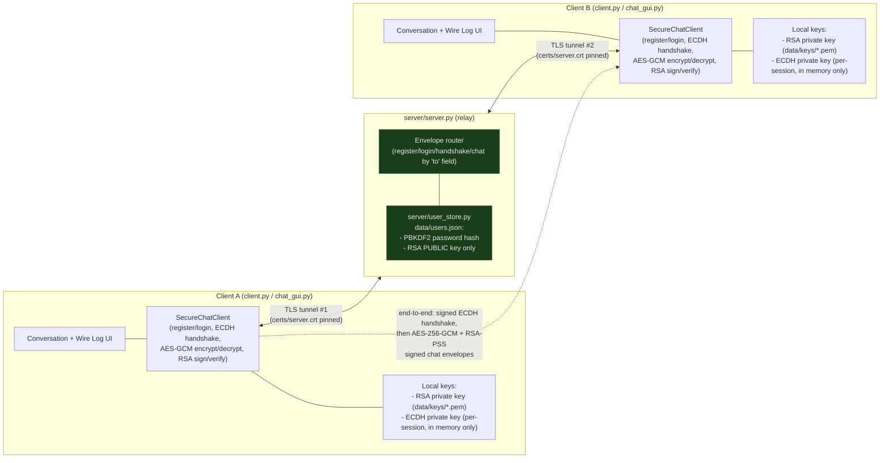

# Architecture

## Overview

Three processes talk over TCP: two `client/client.py` (or `gui/chat_gui.py`) instances
and one `server/server.py` relay. Every connection is wrapped in TLS (Phase 6) end to
end between each client and the server — but the server is a **relay, not a trusted
third party for message content**: it routes envelopes by username and stores
passwords (hashed) and public keys, but the AES-GCM session key and RSA private keys
never reach it. The diagram below shows both boundaries at once: the outer TLS tunnels
(what protects the pipe) and the inner end-to-end layer (what protects the content,
even from the server itself).

## What the server CAN see

- Usernames and the routing metadata of every envelope (who is talking to whom, and
  when — it decides delivery by the `to` field).
- Each user's PBKDF2 password *hash* (never the plaintext password — see
  `auth/password_hash.py`) and RSA *public* key (`server/user_store.py`), both
  submitted once at registration.
- Opaque ECDH public keys during the handshake, and opaque AES-GCM ciphertext/tag for
  every chat message — bytes it can relay but not read, since it never holds the
  session key.
- The plaintext of the register/login envelope *as JSON, before TLS encrypts it for
  transit* — i.e. the server, as the TLS endpoint, necessarily decrypts the connection
  to read routing envelopes. This is why the AES-GCM/RSA layer for chat *content*
  matters even though TLS is also present: TLS protects data in transit to the server,
  not from the server itself. A password is the one piece of data that has no
  additional application-layer protection beyond TLS — see "Known limitations" in the
  main [README.md](../README.md).

## What the server CANNOT see (by design, verified in `tests/`)

- The plaintext of any chat message, ever — only AES-256-GCM ciphertext
  (`tests/test_aes_gcm.py`, `tests/test_tls_setup.py`).
- Either side's ECDH private key, or the derived AES-256 session key
  (`crypto_engine/dh_exchange.py`; the private key is deleted from memory immediately
  after use, never serialized, never sent).
- Either side's RSA private key — only the public key, submitted once at registration
  (`auth/keystore.py`, `crypto_engine/signatures.py`).
- A user's plaintext password — only its PBKDF2 hash is ever persisted
  (`auth/password_hash.py`; `tests/test_password_hash.py::test_hash_does_not_contain_plaintext_password`).

## Threat model this maps to

| Attacker position | What stops them | Where |
|---|---|---|
| On the network, between a client and the server | TLS (Phase 6) — connection is opaque | `certs/`, `connect_tls()` in `client/client.py` |
| Controls/compromises the relay server itself | AES-256-GCM (content), RSA-PSS (handshake + message authenticity) — the server never holds the keys needed to read or forge either | `crypto_engine/aes_gcm.py`, `crypto_engine/signatures.py` |
| Captures a valid envelope and resends it later | Signed timestamp + freshness window + per-sender nonce tracking (Phase 7b) | `client/client.py`'s `is_timestamp_fresh`, `_seen_nonces` |
| Tries to brute-force a captured password hash | PBKDF2, 200,000+ iterations, per-user random salt | `auth/password_hash.py` |

See the main [README.md](../README.md) for the full wire protocol, the live demo
scripts that exercise each of these rows against the real code, and the honest list of
what's *not* covered by this threat model.
